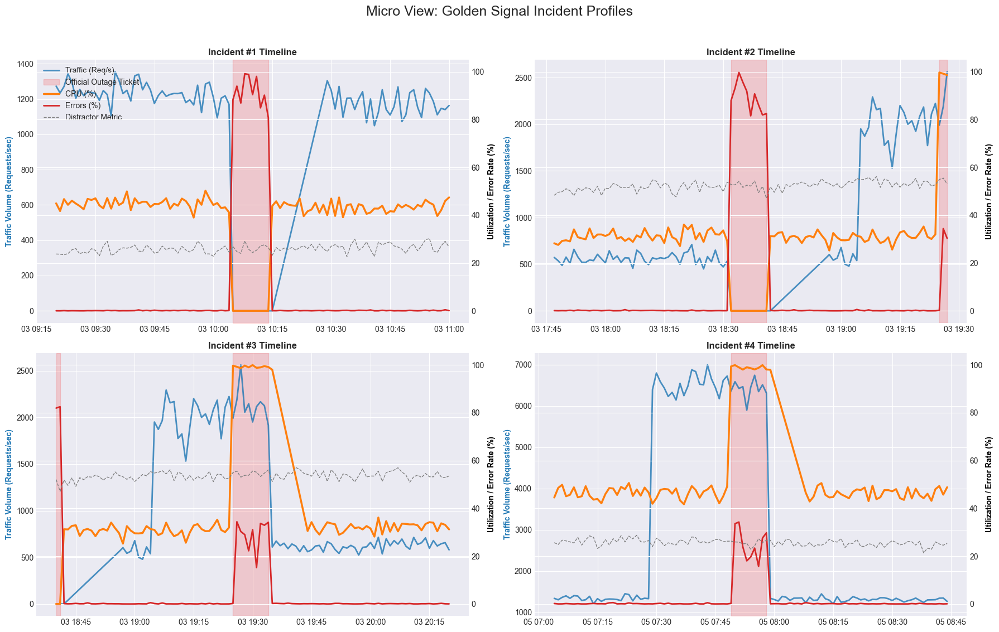
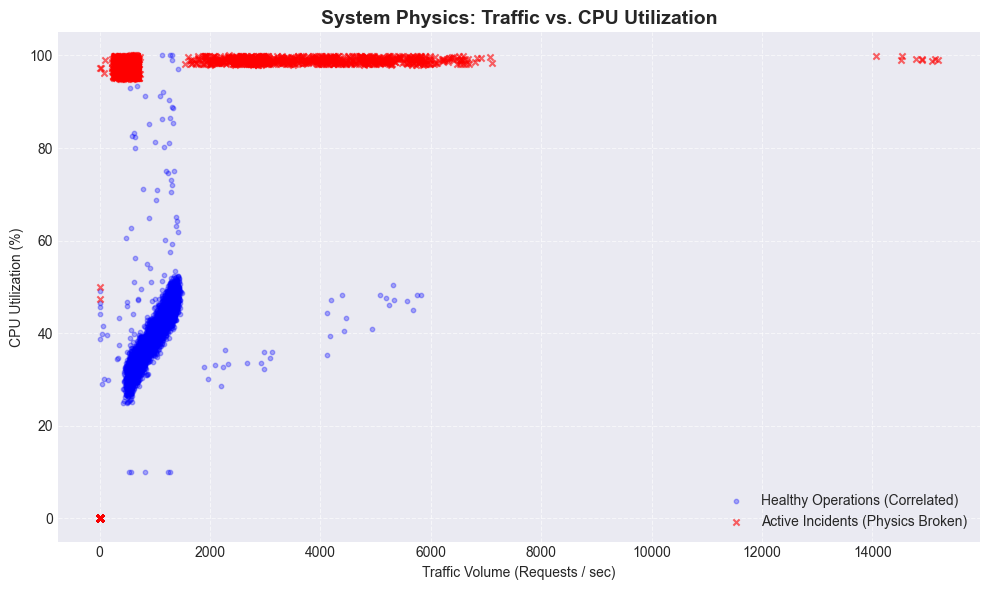
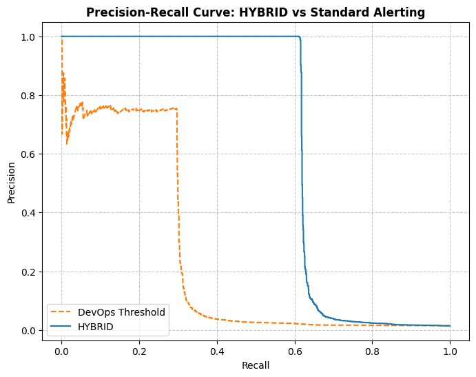

# Predictive Cloud Alerting: Time-Series Anomaly Forecasting

This repository contains an end-to-end Machine Learning pipeline for predicting cloud infrastructure incidents before they occur. It moves beyond traditional static thresholds by formulating a supervised learning problem using sliding windows, enabling proactive Site Reliability Engineering (SRE).

## 1. Problem Formulation
The goal is to predict whether an incident will occur within a future horizon ($H$) based on a sliding window of past metrics ($W$). 

* **Window ($W$):** 60 minutes of historical telemetry.
* **Horizon ($H$):** 15 minutes into the future.
* **Data Structure:** Continuous time-series data is preprocessed into overlapping 3D tensors of shape `(Samples, Timesteps, Features)`. To prevent data leakage, the model is strictly trained to predict *new* incidents, ignoring windows where the system is already in a state of failure.

## 2. The SRE Physics Engine (Data Generation)
Instead of relying on static, non-causal public datasets, this project includes a custom physics engine (`src/data/generator.py`) that synthesizes the "Four Golden Signals" of SRE (Traffic, Errors, Saturation/CPU) alongside background noise metrics.

It simulates three distinct cascading failure profiles:
1. **DDoS Spikes:** A massive surge in traffic (metric 0) that queues up, eventually pushing the CPU to 100% and throwing 500-errors. (20-minute lead time).
2. **Memory Leaks:** A slow, uncontrollable 25-minute upward drift in CPU utilization while traffic remains perfectly normal, eventually resulting in a crash.
3. **Hardware Crashes:** Simulates a fiber cut or power loss. Traffic and CPU drop to 0 instantly with **zero leading indicators**. 

**The Mathematical Ceiling:** Because Hardware Crashes make up roughly 33% of the dataset and are mathematically invisible until the exact second of failure, the absolute maximum theoretical Recall for any model is ~66%. *(Note: When Hardware Crashes are removed from the generator, this architecture achieves >98% Recall and 0.99 PR-AUC).*

### 2.1 Exploratory Data Analysis (Visualizing the Physics)
The generator produces a massive dataset of 500,000 continuous time steps (roughly 347 days of telemetry) containing 5 parallel metric streams and **493 distinct injected incidents**.

**The Causal Incident Timelines**
By zooming in on specific outage windows, we can visually verify the cascading failure profiles. Notice how the model must learn to differentiate between a sudden Traffic spike (blue) driving up CPU (orange), versus a Memory Leak where the CPU drifts upward independently of Traffic.

<p align="center">
  
</p>
<p style="text-align:center;">*(Red shaded regions represent the active incident ticket/downtime).*</p>

**Breaking the System Physics**
In a healthy system, CPU utilization is largely a function of incoming traffic. When an incident occurs, this physical relationship breaks down. The scatter plot below visualizes the exact mathematical boundary our Deep Learning model must learn to map in order to separate the normal load from active anomalies.

<p align="center">
    
</p>
<p style="text-align:center;">*(Blue dots show normal, correlated operations. Red 'X's show active incidents where the physics have broken down).*</p>


## 3. Model Architecture & Selection
The project uses a centralized MLOps registry (`src/models/registry.py`), decoupling data processing from model implementation.

### Baseline: Random Forest
A robust tree-based model that internally flattens the 3D tensor into a 2D array. It serves as a strong baseline but struggles to naturally infer rolling slopes or temporal causation.

### Advanced: Hybrid CNN-LSTM with Skip Connection
A custom PyTorch deep learning architecture tailored for raw time-series:
* **CNN (Trend Extractor):** Uses a wide 15-minute 1D-Convolution kernel to smooth noise and mathematically calculate slopes (crucial for catching slow memory leaks).
* **LSTM (Sequential Causation):** Evaluates the sequence of the CNN's extracted features.
* **Skip Connection:** Concatenates the LSTM's final hidden state with the raw metric values of the final minute, giving the dense decision layer both macro-trends and micro-thresholds.

## 4. Evaluation & SRE Business Value
Standard accuracy and F1-scores are insufficient for highly imbalanced SRE data (1.5% incident rate). This pipeline is evaluated using:
* **PR-AUC:** The Area Under the Precision-Recall Curve.
* **F2-Score:** In SRE, missing a critical outage (False Negative) is significantly more expensive than waking up an engineer for a false alarm (False Positive). We optimize thresholds using the F2-score to mathematically weight Recall twice as heavily as Precision:
  
  $$F_2 = (1 + 2^2) \frac{\text{precision} \times \text{recall}}{(2^2 \times \text{precision}) + \text{recall}}$$

### Results vs. Standard DevOps Heuristics
A standard DevOps alert ("Page me if any metric > 85% right now") yields a PR-AUC of 0.2446 and catches 0 incidents before they happen.

**Hybrid CNN-LSTM Performance:**
* **PR-AUC:** 0.6333 (159% Improvement over baseline)
* **Precision:** 0.9875 (Only 11 False Alarms out of ~99,000 test minutes)
* **Recall:** 0.6157 (Catching nearly every physically predictable anomaly against the ~66% ceiling).

> **Key Insight:**
> While the Hybrid CNN-LSTM achieved the highest PR-AUC (0.6333), the baseline Random Forest performed surprisingly well (0.6204 PR-AUC) once the predictive horizon and physical lead times were perfectly aligned. This proves a core MLOps principle: **Clean, causally aligned data allows simple models to rival complex Deep Learning architectures.** The Deep Learning model ultimately wins by maintaining a higher Precision (fewer false alarms) on the subtle Memory Leaks.

### Real-World Adaptation: Alert Fatigue Protection
If a model outputs a high probability of failure for 10 consecutive minutes, raw ML models will trigger 10 separate pager alerts. To adapt this to a real-world system, the evaluation pipeline applies a **Stateful Cooldown Heuristic**. 

By silencing the pager for 30 minutes after an initial alert fires, the system achieves a **93.4% reduction in alert spam**, routing a clean, actionable signal to the on-call engineer.

### Visualizing the Performance Gap
The Precision-Recall curve below definitively illustrates the value of Deep Learning in this context. The static DevOps threshold (orange dashed line) instantly collapses, while the Hybrid CNN-LSTM (solid blue line) maintains near-perfect precision across the majority of the recall space.

<p align="center">
  
</p>

## 5. Quick Start
**1. Generate Data:**
```bash
python -m scripts.generate_data
```

**2. Train a Model (rf or hybrid):**
```bash
python -m scripts.train --model hybrid
```

**3. Evaluate & Generate Reports:**
```bash
python -m scripts.evaluate --model hybrid
```

Plots are automatically saved to `results/`.